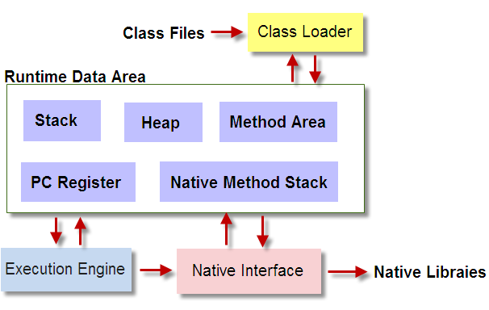
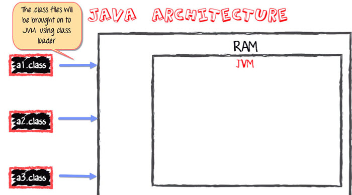
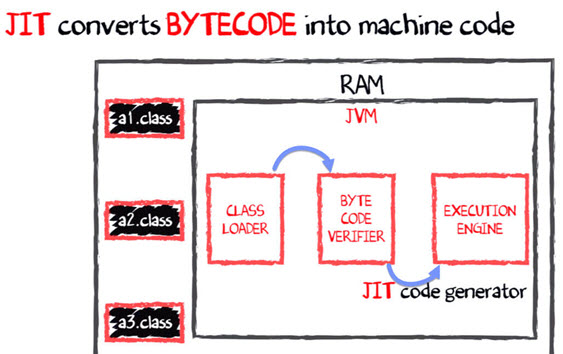

# JVM Architecture
+ 类加载器(class loader)
	+ 加载(Loading)
	+ 链接(Linking)
	+ 初始化(Initialization)
+ 内存
	+ 方法区(Method Area): 方法相关代码
	+ 堆区(Heap): 所有对象，数组，多线程共享
	+ 栈区(Stack): 局部变量，每个线程独有
	+ 程序计数寄存器(PC Registers): 虚拟机指令，每个线程独有
	+ 本地方法栈(Native Method Stacks): 本地代码指令
	+ 执行引擎(Execution Engine)
	+ 本地方法接口(Native Method Interfaces)
	+ 本地方法库(Native Method Libraries)

---
# Java code Compilation and Execution in JVM
+ 编译(compiler)：字节码
---

+ 加载(Loader)：字节码进入虚拟机
---

+ 执行(Execution): JIT编译产生机器码
---

# Why is Java slow?
+ Dynamic Linking: linking is done at run-time, every time the program is run in Java
+ Run-time Interpreter: byte code to native machine code is done at run-time
### 参考资料
---
[JVM](https://www.guru99.com/java-virtual-machine-jvm.html)
