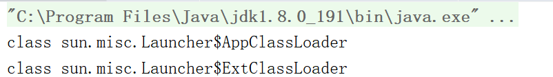

# ClassLoader
+ 第一层
  + Bootstrap（由与操作系统相关的本地代码实现，JVM启动时创建，负责装载最核心的Java类比如Object、System、String等）
+ 第二层
  + Platform ClassLoader(JDK9)(加载一些扩展的系统类，比如 XML、加密、压缩相关的功能类等)
  + Extension ClassLoader(JDK9之前)
+ 第三层
  + Application ClassLoader(主要加载用户定义的类)
# 测试(JDK8)
+ [测试代码](ClassLoaderTest.java)
---

