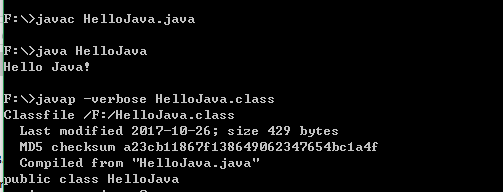
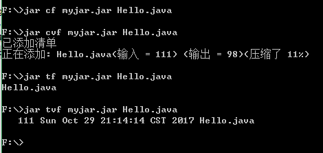
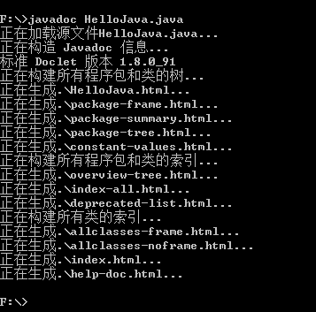

# java program in cmd
+ [编译](#compile)
+ [解释](#interpret)
+ [class文件查看](#view)
+ [压缩](#compress)
+ [解压](#decompress)
+ [生成注释文档](#doc)
+ [编码转换](#code)
+ [打包](#pack)
+ [Java性能分析工具](#console)
---
### The first program in Java
---
```
//Source file
public class HelloJava {
	public static void main(String args[]){
		System.out.println("Hello Java!");
	}
}
```
---
+ <h3 id="compile">编译HelloJava.java文件</h3> 
```
javac HelloJava.java
```
+ <h3 id="interpret">解释HelloJava.class文件</h3> 
```
java HelloJava
```
+ <h3 id="view">查看HelloJava.class内容</h3> 
```
javap -verbose HelloJava.class
```
---

```
Classfile /F:/HelloJava.class
  Last modified 2017-10-26; size 423 bytes
  MD5 checksum bc9c1481256a513db9ca781accdeb234
  Compiled from "HelloJava.java"
public class HelloJava
  minor version: 0
  major version: 52
  flags: ACC_PUBLIC, ACC_SUPER
Constant pool:
   #1 = Methodref          #6.#15         // java/lang/Object."<init>":()V
   #2 = Fieldref           #16.#17        // java/lang/System.out:Ljava/io/PrintStream;
   #3 = String             #18            // Hello Java!
   #4 = Methodref          #19.#20        // java/io/PrintStream.println:(Ljava/lang/String;)V
   #5 = Class              #21            // HelloJava
   #6 = Class              #22            // java/lang/Object
   #7 = Utf8               <init>
   #8 = Utf8               ()V
   #9 = Utf8               Code
  #10 = Utf8               LineNumberTable
  #11 = Utf8               main
  #12 = Utf8               ([Ljava/lang/String;)V
  #13 = Utf8               SourceFile
  #14 = Utf8               HelloJava.java
  #15 = NameAndType        #7:#8          // "<init>":()V
  #16 = Class              #23            // java/lang/System
  #17 = NameAndType        #24:#25        // out:Ljava/io/PrintStream;
  #18 = Utf8               Hello Java!
  #19 = Class              #26            // java/io/PrintStream
  #20 = NameAndType        #27:#28        // println:(Ljava/lang/String;)V
  #21 = Utf8               HelloJava
  #22 = Utf8               java/lang/Object
  #23 = Utf8               java/lang/System
  #24 = Utf8               out
  #25 = Utf8               Ljava/io/PrintStream;
  #26 = Utf8               java/io/PrintStream
  #27 = Utf8               println
  #28 = Utf8               (Ljava/lang/String;)V
{
  public HelloJava();
    descriptor: ()V
    flags: ACC_PUBLIC
    Code:
      stack=1, locals=1, args_size=1
         0: aload_0
         1: invokespecial #1                  // Method java/lang/Object."<init>":()V
         4: return
      LineNumberTable:
        line 1: 0

  public static void main(java.lang.String[]);
    descriptor: ([Ljava/lang/String;)V
    flags: ACC_PUBLIC, ACC_STATIC
    Code:
      stack=2, locals=1, args_size=1
         0: getstatic     #2                  // Field java/lang/System.out:Ljava/io/PrintStream;
         3: ldc           #3                  // String Hello Java!
         5: invokevirtual #4                  // Method java/io/PrintStream.println:(Ljava/lang/String;)V
         8: return
      LineNumberTable:
        line 3: 0
        line 4: 8
}
SourceFile: "HelloJava.java"
```
---
+<h3 id="compress">将Hello.java压缩为myjar.jar</h3>
	+ jar cf myjar.jar Hello.jar(不显示处理信息)
	+ jar cvf myjar.jar Hello.jar(显示打包详细信息)
	+ jar tf myjar.jar Hello.jar(显示jar文件目录和文件列表信息)
	+ jar tvf myjar.jar Hello.jar(显示jar文件目录和文件列表信息和文件大小，创建时间详细信息)
---

---
+ <h3 id="decompress">解压myjar.jar文件</h3>
	+ jar xf myjar.jar(不显示解压信息)
	+ jar xf myjar.jar(显示解压详细信息)
---

---
+ 带参执行
---
```
//source file
public class Param {
	public static void main(String[] args) {
		int len=args.length;
		for(int i=0;i<len;i++){
			System.out.printf("args[%d]=%s%n",i,args[i]);
		}
	}
}
```
---

---
+ j<h3 id="doc">生成注释文档</h3>
```
javadoc HelloJava.java
```
---

---
### 源文件text.txt
```
//text.txt
我是唐龙
```
+ <h3 id="code">编码转换</h3>
	+ native2ascii text.txt test.txt 将text.txt的内容转为本地编码并存储到test.txt文件中
	---
	```
	//test.txt
	\u6211\u662f\u5510\u9f99
	```
	---
	+ native2ascii -encoding gbk text.txt test.txt 将text.txt的内容转换为gbk编码并存储到test.txt文件中(此时本地编码是gbk)
	```
	//test.txt
	\u6211\u662f\u5510\u9f99
	```
+ JDK <h3 id="pack">打包</h3>：jar cvf 目标文件名.jar 需要打包的文件
  例如：将tree.txt 打包为tree.jar的命令，jar cvf tree.jar tree.txt
---
+ <h3 id="console">Java性能分析</h3>
配置好JAVA_HOME/bin,在cmd输入jconsole

