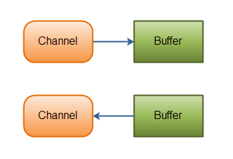

# Java NIO
### 核心组成
+ Channels
	+ FileChannel
	+ DatagramChannel
	+ SocketChannel
	+ ServerSocketChannel
+ Buffers
	+ ByteBuffer
	+ CharBuffer
	+ DoubleBuffer
	+ FloatBuffer
	+ IntBuffer
	+ LongBuffer
	+ ShortBuffer
	```
	数据可以从Channel读到Buffer中，也可以从Buffer 写到Channel中
	```
	---
	
	---
+ Selectors(Selector允许单线程处理多个 Channel)
---

---